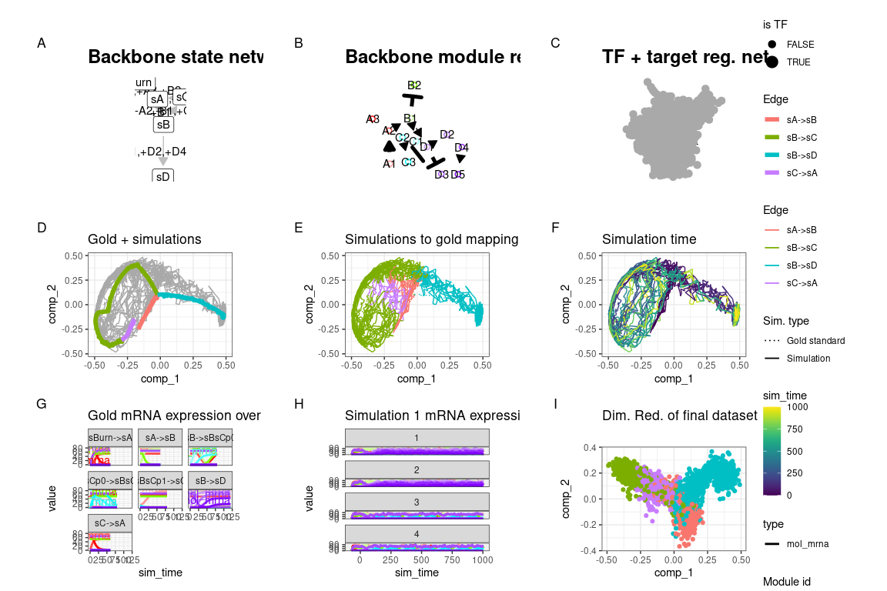
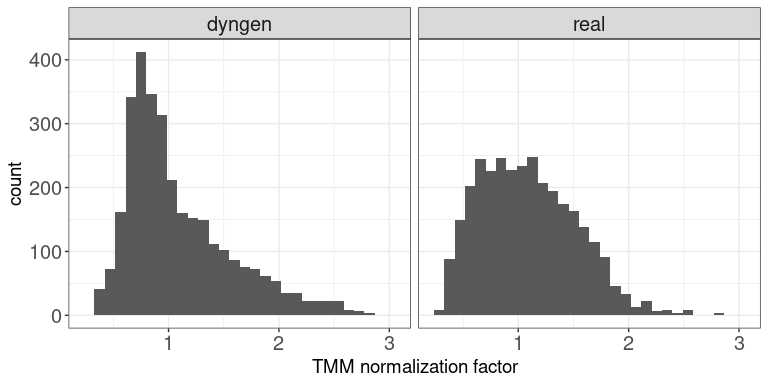
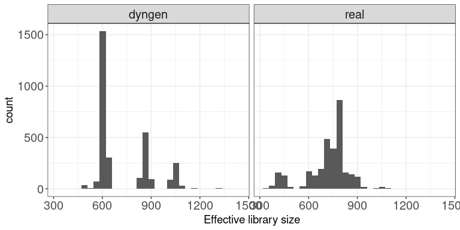
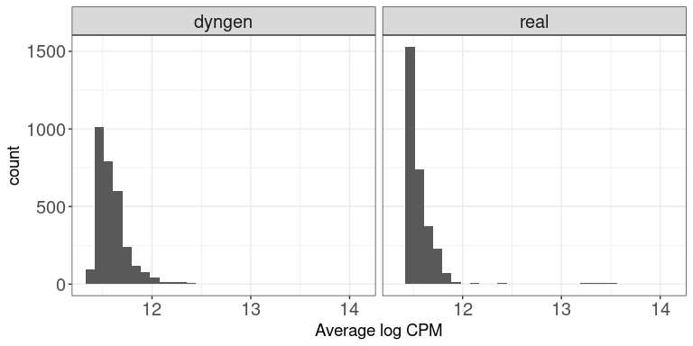
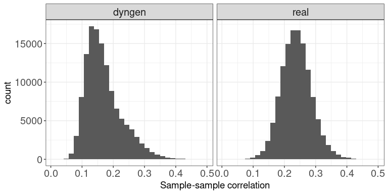
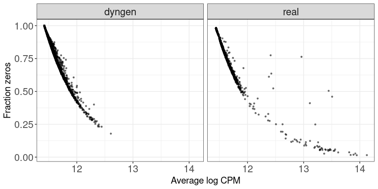
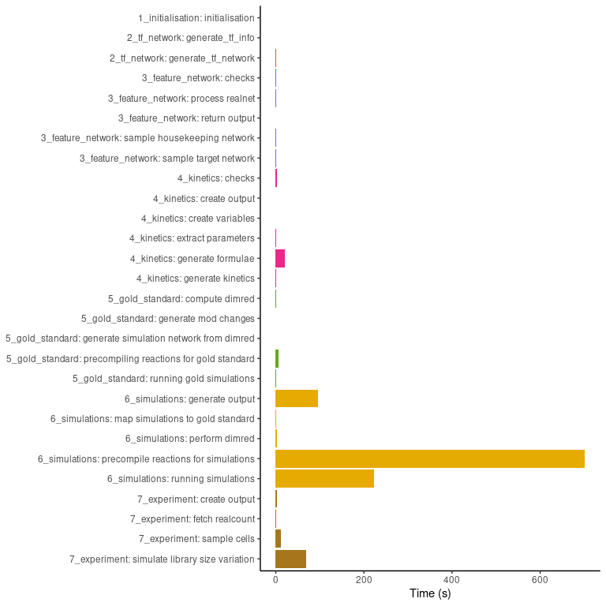
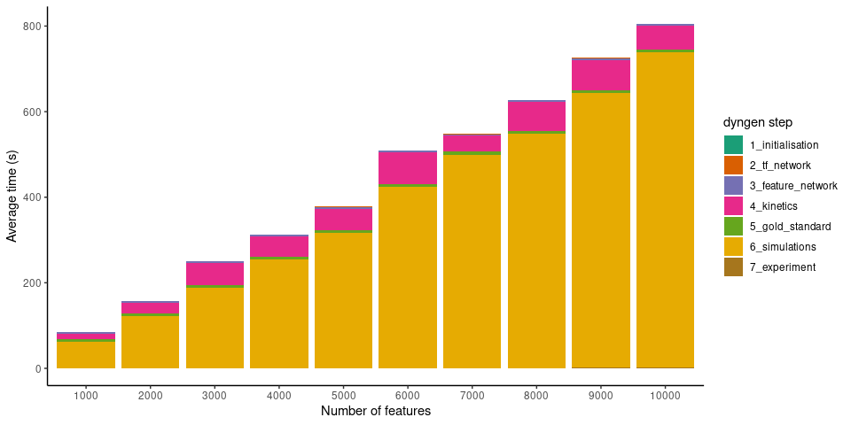

<!-- Notes (remove this before submitting)
dyngen manuscript v4  
github.com/dynverse/dyngen  
github.com/dynverse/dyngen_manuscript
dyngen.dynverse.org


Antwoord naar editor: wordt gebruikt in dynverse, tradeseq, cellrank, BEELINE
-->

# dyngen rebuttal


We would like to thank the reviewer for the constructive comments, which has motivated us to greatly improve the experiments performed in this work and the documentation provided for the tool. Notable changes are:


 * We created a documentation website available at [dyngen.dynverse.org](https://dyngen.dynverse.org). [a]Several insights 
 * We simplified and reran all use-case experiments, which allowed us to add some interpretation of the results for each of the use cases.
 * We performed new experiments assessing the scalability of dyngen and the similarity in output in comparison to a reference (real) dataset. The results are included in the supplementary material.
 As we think that several of the remarks raised by the reviewer are also interesting for the target audience of the paper, we not only include our responses to these remarks here, but in addition have created several tutorials that can be used to perform these experiments with dyngen.  These tutorials now also allow users to reproduce some of the additional analyses requested by the reviewer, and they have been added to a new website that we created for our method, with a lot more documentation website ([dyngen.dynverse.org](https://dyngen.dynverse.org)).
* … todo, add more ...[b]

## Comment 1
> Bioinformatics has been looking into GRNs, their simulation and estimation for more than a decade (in bulk at the time), and I miss some important references and insights from then. Such as alternate definitions of what a GRN is - eg does logic play a role, should you use boolean networks (see Albert&Othma, JTB 2003) -, do old-school bulk simulators such as GeneNetWeaver (Bioinformatics 2011) be used, can one use transformation methods (eg Wittmann et al, BMC Sysbio 2009) and how is this different from what has been introduced here (what is novelty here).


Certainly simulating expression datasets using GRNs has been around for a long time and dyngen is inspired heavily by such software (GeneNetWeaver in particular).  Nevertheless, there are great differences between bulk and single-cell simulators:  the data characteristics of single-cell omics are vastly different from bulk omics, typically having much lower library sizes and a higher dropout rate, but also a high number of profiles. The low library sizes, in particular, are problematic as ODEs are ill-suited for performing low-molecule simulations. This necessitates the development of new single-cell simulators.


We have added paragraph §3 to the introduction to discuss the relevance of bulk simulators and why they are not suitable for simulating single-cell expression data:


> Simulating realistic data requires that the underlying biology is recapitulated as best as possible, and in the case of transcriptomics data this typically involves modelling the underlying gene regulatory networks. Simulators of "bulk" microarray or RNA-sequencing profiles simulate biological processes (e.g. transcription, translation) by translating a database of known regulatory interactions into a set of ordinary differential equations (ODE) [@roy_systemgeneratingtranscription_2008; @hache_gengesystematicgeneration_2009; @schaffter_genenetweaversilicobenchmark_2011; @vandenbulcke_syntrengeneratorsynthetic_2006]. These methods have been instrumental in performing benchmarking studies [@prill_rigorousassessmentsystems_2010; @marbach_revealingstrengthsweaknesses_2010; @marbach_wisdomcrowdsrobust_2012]. However, the advent of single-cell omics introduced several new types of analyses (e.g. trajectory inference, RNA velocity, cell-specific network inference) which exploit the higher resolution of single-cell versus bulk omics [@luecken_currentbestpractices_2019]. In addition, the data characteristics of single-cell omics are vastly different from bulk omics, typically having much lower library sizes and a higher dropout rate, but also a high number of profiles [@vallejos_normalizingsinglecellrna_2017]. The low library sizes, in particular, are problematic as ODEs are ill-suited for performing low-molecule simulations [@gillespie_exactstochasticsimulation_1977]. This necessitates the development of new single-cell simulators.

## Comment 2
> Similarly, the single cell genomics field has used simulations also for dynamics for some time as evaluation at least implicitely. Please discuss advances and differences or similarities to those, eg. to simulations from (Ocone, Bioinf 2015) or (Pratapa, Nat Meth 2020).


We expanded upon paragraph §4 and made a more direct comparison to the methods listed in Supplemental Table 1. Paragraph §4: 


> To this end, single-cell omics simulators emulate the technical procedures from single-cell omics protocols. Simulators such as Splatter [@zappia_splattersimulationsinglecell_2017], powsimR [@vieth_powsimrpoweranalysis_2017], PROSSTT [@papadopoulos_prossttprobabilisticsimulation_2019] and SymSim [@zhang_simulatingmultiplefaceted_2019]) have already been widely used to compare single-cell methods [@street_slingshotcelllineage_2018; @parra_reconstructingcomplexlineage_2019; @lummertzdarocha_reconstructioncomplexsinglecell_2018; @lin_scclassifysamplesize_2020] and perform independent benchmarks [@duo_systematicperformanceevaluation_2018; @saelens_comparisonsinglecelltrajectory_2019; @soneson_biasrobustnessscalability_2018]. However, by focusing more on simulating the single-cell omics protocol (e.g. RNA capture, amplification, sequencing) and less on the underlying biology (e.g. transcription, splicing, translation), their applicability and reusability is limited towards the specific application for which they were designed (e.g. benchmarking clustering or differential expression methods), and extending these tools to include additional modalities or experimental conditions is challenging.


We did not include the reference to Ocone Bioinf 2015 as the advances proposed by this research were mainly related to performing Network Inference. In terms of generating synthetic data, the simulator used by Ocone et al. offered little advantage over aforementioned bulk simulators. We also did not include a reference to Pratapa et al., as their methodology is borrowed heavily from dyngen itself and offers little advantage over it.


## Comment 3
> One of the main aims of any simulation framework should be to capture features of real biological data. I’d be great if the authors could demonstrate the fidelity of the generated data by comparing it to some real datasets, e.g. distribution of mean gene expression and number of zero counts per gene. How does it perform compared to other simulation frameworks? This would help me as well as community to evaluate how realistic the induced gene correlations/dependencies are, and what may be missing.


A vignette has been added to the package and supplementary material which uses countsimQC [@soneson_unifiedqualityverification_2018] to explore the characteristics of an dyngen simulation and the reference dataset used by it ([dyngen.dynverse.org/articles/advanced_topics/comparison_reference.html](https://dyngen.dynverse.org/articles/advanced_topics/comparison_reference.html)). The distribution plots in this vignette, while not perfect, nicely demonstrates that the output generated by dyngen mimics the given reference dataset for the evaluated metrics.


## Comment 4
> Simulated data for the described key applications of dyngen (network inference, trajectory alignment, and RNA velocity) has already been generated within the respective works of lioness (Fig. S1+S4), cellAlign (Fig. S6), velocyto (Fig. S5), scvelo (Fig. S3), dynamo (Fig. 1), many of which also use Gillespie. What does dyngen add conceptually?


We modified paragraphs §5 and §6 to better highlight the scientific contributions dyngen makes:


> We introduce dyngen, a method for simulating cellular dynamics at a single-cell, single-transcript resolution (Figure\ \ref{fig:overview}). This problem is tackled in three fully-configurable main steps. First, biological processes are mimicked by translating a gene regulatory network in a set of reactions (regulation, transcription, splicing, translation). Second, individual cells are simulated using Gillespie's stochastic simulation algorithm [@gillespie_exactstochasticsimulation_1977], which is designed to work well in low-molecule simulations. Finally, real reference datasets are used to emulate single-cell omics profiling protocols.
> 
> Throughout a simulation, dyngen tracks many layers of information, including the abundance of any molecule in the cell, the progression of the cell along a dynamic process, and the activation strength of individual regulatory interactions. In addition, dyngen can simulate a large variety of dynamic processes (e.g. cyclic, branching, disconnected) as well as a broad range of experimental conditions (e.g. batch effects and time-series, perturbation and single-cell knockdown experiments). For these reasons, dyngen can cater to a wide range of benchmarking applications, including trajectory inference, trajectory alignment, and trajectory differential expression (Table\ \ref{tab:comparison}).


To the best of our knowledge, the works listed above use very different approaches to benchmarking their tool:


* LIONESS, network inference method: Uses randomly generated networks & boolean networks to generate synthetic data. The networks used to generate datasets are very synthetic and completely devoid of any biological relevance. By using Gillespie's SSA algorithm instead of boolean networks, we can use dyngen to track many layers of information (e.g. the number of times a biological reaction has been triggered during a given time interval). This allows us to benchmark methods which require this information (e.g. RNA velocity).
* cellAlign, trajectory alignment: Perturbs real datasets to assess the robustness of cellAlign. When benchmarking a tool, assessing its robustness is almost as important as assessing its accuracy. Robustness analysis can be performed without knowing the gold standard, whereas the gold standard is needed for assessing the accuracy of a tool.
* velocyto, RNA velocity: Uses ODEs to simulate splicing mechanics. The code for reproducing these datasets couldn't be found. Based on the description, these simulations were limited to simulating only the splicing mechanics under a particular set of conditions, thereby limiting its applicability outside of this particular context.
* scvelo, RNA velocity: Same as velocyto.
* dynamo, RNA velocity: Uses Gillespie's SSA to simulate splicing reactions. However, this system is very limited, including only two genes. This application of Gillespie's SSA seems very tailored towards this particular use-case and would require major redesigns to be made applicable elsewhere.


It should be noted that from the list above, only LIONESS really compares its accuracy performance with other methods using a quantitative metric. We would thus argue that these cases further highlight the need for broadly applicable synthetic data generators such as dyngen.

## Comment 5
> The authors evaluate several computational tools, including the afore-mentioned. Even if the authors mention not to aim for a large-scale benchmarking, they still should provide some insights into why some tools perform better than others. Having an interpretable simulation engine in hand, it is unfortunate that it yet lacks any explanation and the reader is left alone with performance statements that are not well-founded. Some intuition would be very desirable. Why does SCENIC outperform the other methods? Why does smoothing improve trajectory alignment? And what causes differences in velocity estimation? Could you, for instance, generate an example where the differences in velocity estimates become more obvious, where one estimation procedure fails to fully capture the known direction?


Performing in-depth benchmarks on each of these use-cases can be considered separate studies on their own and is beyond the scope of this work. However, we did reanalyse the experiments and added some interpretation to the respective sections.


 * Trajectory alignment: We removed DTW+smoothing (as it was a custom method developed for the sake of this analysis) and added cellAlign to the comparison, as cellAlign also uses smoothing and DTW to get to the same objective, and has been developed specifically with single cell data in mind.
 * RNA velocity: We removed some parameter settings which are designed to be very similar and thus have no added benefit in the visualisation. We removed the 'difficulty' settings for the different datasets, as the 'easy' and 'medium' datasets were unrealistic; only the 'hard' settings were retained. While there are no large difference in performance between the different methods, we added interpretation on why methods obtain low scores on one metric and high scores on the other.
 * Cell-specific network inference: We added information on why certain methods significantly outperform others and provide possible solutions to problems, where possible.


## Minor comment 1
> Could the authors please discuss runtime and scalability, which obviously can easily become a weakness for such a complex model.


A vignette has been added to the package and supplementary material explores the execution time of dyngen for an increasing number of cells and genes ([dyngen.dynverse.org/articles/advanced_topics/scalability_and_runtime.html](https://dyngen.dynverse.org/articles/advanced_topics/scalability_and_runtime.html)). These figures show that the execution time of dyngen scales linearly w.r.t. the number of cells and also linearly w.r.t. the number of genes. 


## Minor comment 2
> Please state how many genes have been used in the examples. It seems like the number of genes used in the examples is rather small (< 100). Wouldn’t it be better to use a more realistic number of features (~10,000)?


Unfortunately, the examples shown in the package documentation need to be very small to abide by CRAN package submission policies, as the complete testing of the software package (including but not limited to running all examples) can strictly take 10 minutes on CRAN's server using only one thread. 


However, the scalability vignette mentioned above also shows the execution time of each of the steps taken by dyngen in simulating a 10'000 by 10'000 dataset, which takes about 20 minutes to complete. 


## Minor comment 3
> Congratulations for making the clearly documented package available. Installation and going through the vignette works fine. At several points during the simulation files are downloaded without asking permission. It may be better practice to ask the user for permission, or download into a temporary directory, or read the files directly without downloading, or include in the package etc. 


By default, required files are downloaded to a temporary directory. Unfortunately, these files cannot be included inside the package as they are reference datasets which are much larger than what is allowed by CRAN policies.


Based on the reviewers suggestion, we modified the installation instructions such that it better reflects that files will be downloaded when using dyngen, and provides instructions on how to configure the system such that it will cache these files in a user-specified directory ([dyngen.dynverse.org/articles/installation.html](https://dyngen.dynverse.org/articles/installation.html)).


## Minor comment 4
> Further, it might be very useful to output the simulated data to a standard object, such as Seurat or SingleCellExperiment, or to provide instructions on how to convert it.


Thank you for this suggestion. We agree that conversion functions from the typical dyngen output to the typical object types familiar to single-cell omics programmers would be very useful. Therefore, we included such functions in the latest version of dyngen to convert its output to the following formats: anndata, dyno, SingleCellExperiment, Seurat.


[a]containing what?
[b]todo

# Supplementary Files


## Vignette: Comparison to reference dataset

In this vignette, we will take a look at characteristic features of
dyngen versus the reference dataset it uses. To this end, we’ll be using
[`countsimQC`](https://www.bioconductor.org/packages/release/bioc/html/countsimQC.html)
[@soneson_unifiedqualityverification_2018] to calculate key statistics of both datasets
and create comparative visualisations.


### Run dyngen simulation

We use an internal function from the dyngen package to download and
cache one of the reference datasets.

``` r
library(tidyverse)
library(dyngen)

set.seed(1)

data("realcounts", package = "dyngen")
name_realcounts <- "zenodo_1443566_real_silver_bone-marrow-mesenchyme-erythrocyte-differentiation_mca"
url_realcounts <- realcounts %>% filter(name == name_realcounts) %>% pull(url)
realcount <- dyngen:::.download_cacheable_file(url_realcounts, getOption("dyngen_download_cache_dir"), verbose = FALSE)
```

We run a simple dyngen dataset as follows, where the number of cells and
genes are determined by the size of the reference dataset.

``` r
backbone <- backbone_bifurcating_loop()

num_cells <- nrow(realcount)
num_feats <- ncol(realcount)
num_tfs <- nrow(backbone$module_info)
num_tar <- round((num_feats - num_tfs) / 2)
num_hks <- num_feats - num_tfs - num_tar

config <-
  initialise_model(
    backbone = backbone,
    num_cells = num_cells,
    num_tfs = num_tfs,
    num_targets = num_tar,
    num_hks = num_hks,
    gold_standard_params = gold_standard_default(),
    simulation_params = simulation_default(
      total_time = 1000,
      experiment_params = simulation_type_wild_type(num_simulations = 100)
    ),
    experiment_params = experiment_snapshot(
      realcount = realcount
    ),
    verbose = FALSE
  )
```

``` r

# the simulation is being sped up because rendering all vignettes with one core

# for pkgdown can otherwise take a very long time
set.seed(1)

config <-
  initialise_model(
    backbone = backbone,
    num_cells = num_cells,
    num_tfs = num_tfs,
    num_targets = num_tar,
    num_hks = num_hks,
    verbose = interactive(),
    download_cache_dir = tools::R_user_dir("dyngen", "data"),
    simulation_params = simulation_default(
      total_time = 1000,
      census_interval = 2, 
      ssa_algorithm = ssa_etl(tau = 300/3600),
      experiment_params = simulation_type_wild_type(num_simulations = 10)
    ),
    experiment_params = experiment_snapshot(
      realcount = realcount
    )
  )
```

``` r
out <- generate_dataset(config, make_plots = TRUE)
```

    ## Generating TF network
    ## Sampling feature network from real network
    ## Generating kinetics for 3025 features
    ## Generating formulae
    ## Generating gold standard mod changes
    ## Precompiling reactions for gold standard
    ## Running gold simulations
    ##   |                                                  | 0 % elapsed=00s     |========                                          | 14% elapsed=00s, remaining~01s  |===============                                   | 29% elapsed=00s, remaining~00s  |======================                            | 43% elapsed=00s, remaining~00s  |=============================                     | 57% elapsed=00s, remaining~00s  |====================================              | 71% elapsed=00s, remaining~00s  |===========================================       | 86% elapsed=00s, remaining~00s  |==================================================| 100% elapsed=01s, remaining~00s
    ## Precompiling reactions for simulations
    ## Running 10 simulations
    ## Mapping simulations to gold standard
    ## Performing dimred
    ## Simulating experiment
    ## Wrapping dataset
    ## Making plots

``` r
out$plot
```

<!-- -->

Both datasets are stored in a list for easy usage by countsimQC.

``` r
datasets <- list(
  real = t(as.matrix(realcount)),
  dyngen = t(as.matrix(out$dataset$counts))
)

ddsList <- lapply(datasets, function(ds) {
  DESeq2::DESeqDataSetFromMatrix(
    countData = round(as.matrix(ds)), 
    colData = data.frame(sample = seq_len(ncol(ds))), 
    design = ~1
  )
})
```


### Run countsimQC computations

Below are some computations countsimQC makes. Normally these are not
visible to the user, but for the sake of transparency these are included
in the vignette.

``` r
library(countsimQC)


### Define helper objects
nDatasets <- length(ddsList)
colRow <- c(2, 1)
panelSize <- 4
thm <- 
  theme_bw() + 
  theme(
    axis.text = element_text(size = 15),
    axis.title = element_text(size = 14),
    strip.text = element_text(size = 15)
  )
```

Compute key characteristics

``` r
obj <- countsimQC:::calculateDispersionsddsList(ddsList = ddsList, maxNForDisp = Inf)

sampleCorrDF <- countsimQC:::calculateSampleCorrs(ddsList = obj, maxNForCorr = 500)

featureCorrDF <- countsimQC:::calculateFeatureCorrs(ddsList = obj, maxNForCorr = 500)
```

Summarize sample characteristics

``` r
sampleDF <- map2_df(obj, names(obj), function(x, dataset_name) {
  tibble(
    dataset = dataset_name,
    Libsize = colSums(x$dge$counts),
    Fraczero = colMeans(x$dge$counts == 0),
    TMM = x$dge$samples$norm.factors,
    EffLibsize = Libsize * TMM
  )
})
```

Summarize feature characteristics

``` r
featureDF <- map2_df(obj, names(obj), function(x, dataset_name) {
  rd <- SummarizedExperiment::rowData(x$dds)
  tibble(
    dataset = dataset_name,
    Tagwise = sqrt(x$dge$tagwise.dispersion),
    Common = sqrt(x$dge$common.dispersion),
    Trend = sqrt(x$dge$trended.dispersion),
    AveLogCPM = x$dge$AveLogCPM,
    AveLogCPMDisp = x$dge$AveLogCPMDisp, 
    average_log2_cpm = apply(edgeR::cpm(x$dge, prior.count = 2, log = TRUE), 1, mean), 
    variance_log2_cpm = apply(edgeR::cpm(x$dge, prior.count = 2, log = TRUE), 1, var),
    Fraczero = rowMeans(x$dge$counts == 0),
    dispGeneEst = rd$dispGeneEst,
    dispFit = rd$dispFit,
    dispFinal = rd$dispersion,
    baseMeanDisp = rd$baseMeanDisp,
    baseMean = rd$baseMean
  )
})
```

Summarize data set characteristics

``` r
datasetDF <- map2_df(obj, names(obj), function(x, dataset_name) {
  tibble(
    dataset = dataset_name,
    prior_df = paste0("prior.df = ", round(x$dge$prior.df, 2)),
    nVars = nrow(x$dge$counts),
    nSamples = ncol(x$dge$counts),
    AveLogCPMDisp = 0.8 * max(featureDF$AveLogCPMDisp),
    Tagwise = 0.9 * max(featureDF$Tagwise)
  )
})
```


### Data set dimensions

These bar plots show the number of samples (columns) and features (rows)
in each data set.

Number of samples (columns)

``` r
ggplot(datasetDF, aes(x = dataset, y = nSamples, fill = dataset)) + 
  geom_bar(stat = "identity", alpha = 0.5) + 
  xlab("") + ylab("Number of samples (columns)") + 
  thm + theme(axis.text.x = element_text(angle = 90, hjust = 1, vjust = 0.5))
```

<!-- -->

Number of features (rows)

``` r
ggplot(datasetDF, aes(x = dataset, y = nVars, fill = dataset)) + 
  geom_bar(stat = "identity", alpha = 0.5) + 
  xlab("") + ylab("Number of features (rows)") + 
  thm + theme(axis.text.x = element_text(angle = 90, hjust = 1, vjust = 0.5))
```

<!-- -->


### Dispersion/BCV plots

Disperson/BCV plots show the association between the average abundance
and the dispersion or “biological coefficient of variation”
(sqrt(dispersion)), as calculated by
[`edgeR`](https://bioconductor.org/packages/release/bioc/html/edgeR.html)
[@robinson_edgerbioconductorpackage_2010] and
[`DESeq2`](http://bioconductor.org/packages/release/bioc/html/DESeq2.html)
[@love_moderatedestimationfold_2014]. In the `edgeR` plot, the estimate of the
prior degrees of freedom is indicated.


#### edgeR

The black dots represent the tagwise dispersion estimates, the red line
the common dispersion and the blue curve represents the trended
dispersion estimates. For further information about the dispersion
estimation in `edgeR`, see Chen et al. [@chen_differentialexpressionanalysis_2014].

``` r
ggplot(featureDF %>% dplyr::arrange(AveLogCPMDisp), 
       aes(x = AveLogCPMDisp, y = Tagwise)) + 
  geom_point(size = 0.25, alpha = 0.5) + 
  facet_wrap(~dataset, nrow = colRow[2]) + 
  geom_line(aes(y = Trend), color = "blue", size = 1.5) + 
  geom_line(aes(y = Common), color = "red", size = 1.5) +
  geom_text(data = datasetDF, aes(label = prior_df)) + 
  xlab("Average log CPM") + ylab("Biological coefficient of variation") + 
  thm
```

<!-- -->


#### DESeq2

The black dots are the gene-wise dispersion estimates, the red curve the
fitted mean-dispersion relationship and the blue circles represent the
final dispersion estimates.For further information about the dispersion
estimation in `DESeq2`, see Love et al. [@love_moderatedestimationfold_2014].

``` r
ggplot(featureDF %>% dplyr::arrange(baseMeanDisp), 
       aes(x = baseMeanDisp, y = dispGeneEst)) + 
  geom_point(size = 0.25, alpha = 0.5) + 
  facet_wrap(~dataset, nrow = colRow[2]) + scale_x_log10() + scale_y_log10() +  
  geom_point(aes(y = dispFinal), color = "lightblue", shape = 21) + 
  geom_line(aes(y = dispFit), color = "red", size = 1.5) + 
  xlab("Base mean") + ylab("Dispersion") + 
  thm
```

<!-- -->


### Mean-variance plots

This scatter plot shows the relation between the empirical mean and
variance of the features. The difference between these mean-variance
plots and the mean-dispersion plots above is that the plots in this
section do not take the information about the experimental design and
sample grouping into account, but simply display the mean and variance
of log2(CPM) estimates across all samples, calculated using the `cpm`
function from
[`edgeR`](https://bioconductor.org/packages/release/bioc/html/edgeR.html)
[@robinson_edgerbioconductorpackage_2010], with a prior count of 2.

``` r
ggplot(featureDF, aes(x = average_log2_cpm, y = variance_log2_cpm)) + 
  geom_point(size = 0.75, alpha = 0.5) + 
  facet_wrap(~dataset, nrow = colRow[2]) + 
  xlab("Mean of log2(CPM)") + ylab("Variance of log2(CPM)") + 
  thm
```

<!-- -->


### Library sizes

This plot shows a histogram of the total read count per sample, i.e.,
the column sums of the respective data matrices.

``` r
ggplot(sampleDF, aes(x = Libsize)) + geom_histogram(bins = 30) + 
  facet_wrap(~dataset, nrow = colRow[2]) +
  xlab("Library size") + thm
```

<!-- -->


### TMM normalization factors

This plot shows a histogram of the TMM normalization factors [@robinson_scalingnormalizationmethod_2010], intended to adjust for differences in RNA
composition, as calculated by
[`edgeR`](https://bioconductor.org/packages/release/bioc/html/edgeR.html)
[@robinson_edgerbioconductorpackage_2010].

``` r
ggplot(sampleDF, aes(x = TMM)) + geom_histogram(bins = 30) + 
  facet_wrap(~dataset, nrow = colRow[2]) +
  xlab("TMM normalization factor") + thm
```

<!-- -->


### Effective library sizes

This plot shows a histogram of the “effective library sizes,” defined as
the total count per sample multiplied by the corresponding TMM
normalization factor.

``` r
ggplot(sampleDF, aes(x = EffLibsize)) + geom_histogram(bins = 30) + 
  facet_wrap(~dataset, nrow = colRow[2]) +
  xlab("Effective library size") + thm
```

<!-- -->


### Expression distributions (average log CPM)

This plot shows the distribution of average abundance values for the
features. The abundances are log CPM values calculated by `edgeR`.

``` r
ggplot(featureDF, aes(x = AveLogCPM)) + geom_histogram(bins = 30) + 
  facet_wrap(~dataset, nrow = colRow[2]) +
  xlab("Average log CPM") + thm
```

<!-- -->


### Fraction zeros per sample

This plot shows the distribution of the fraction of zeros observed per
sample (column) in the count matrices.

``` r
ggplot(sampleDF, aes(x = Fraczero)) + geom_histogram(bins = 30) + 
  facet_wrap(~dataset, nrow = colRow[2]) +
  xlab("Fraction zeros per sample") + thm
```

<!-- -->


### Fraction zeros per feature

This plot illustrates the distribution of the fraction of zeros observed
per feature (row) in the count matrices.

``` r
ggplot(featureDF, aes(x = Fraczero)) + geom_histogram(bins = 30) + 
  facet_wrap(~dataset, nrow = colRow[2]) +
  xlab("Fraction zeros per feature") + thm
```

<!-- -->


### Sample-sample correlations

The plot below shows the distribution of Spearman correlation
coefficients for pairs of samples, calculated from the log(CPM) values
obtained via the `cpm` function from `edgeR`, with a prior.count of 2.

``` r
ggplot(sampleCorrDF, aes(x = Correlation)) + geom_histogram(bins = 30) + 
  facet_wrap(~dataset, nrow = colRow[2]) +
  xlab("Sample-sample correlation") + thm
```

<!-- -->


### Feature-feature correlations

This plot illustrates the distribution of Spearman correlation
coefficients for pairs of features, calculated from the log(CPM) values
obtained via the `cpm` function from `edgeR`, with a prior.count of 2.
Only non-constant features are considered.

``` r
ggplot(featureCorrDF, aes(x = Correlation)) + geom_histogram(bins = 30) + 
  facet_wrap(~dataset, nrow = colRow[2]) +
  xlab("Feature-feature correlation") + thm
```

<!-- -->


### Library size vs fraction zeros

This scatter plot shows the association between the total count (column
sums) and the fraction of zeros observed per sample.

``` r
ggplot(sampleDF, aes(x = Libsize, y = Fraczero)) + 
  geom_point(size = 1, alpha = 0.5) + 
  facet_wrap(~dataset, nrow = colRow[2]) + 
  xlab("Library size") + ylab("Fraction zeros") + thm
```

<!-- -->


### Mean expression vs fraction zeros

This scatter plot shows the association between the average abundance
and the fraction of zeros observed per feature. The abundance is defined
as the log(CPM) values as calculated by `edgeR`.

``` r
ggplot(featureDF, aes(x = AveLogCPM, y = Fraczero)) + 
  geom_point(size = 0.75, alpha = 0.5) + 
  facet_wrap(~dataset, nrow = colRow[2]) + 
  xlab("Average log CPM") + ylab("Fraction zeros") + thm
```

<!-- -->


## Vignette: On scalability and runtime


In this vignette, we will take a look at the runtime of dyngen as the
number of genes and the number of cells sampled is increased. We’ll be
using the bifurcating cycle backbone which is well known for its
beautiful 3D butterfly shape!

``` r
library(dyngen)
library(tidyverse)

set.seed(1)

save_dir <- "scalability_and_runtime_runs"
if (!dir.exists(save_dir)) dir.create(save_dir, recursive = TRUE)

backbone <- backbone_bifurcating_cycle()
```


### Initial run

We’ll be running this simulation a few times, with different values for
`num_cells` and `num_features` to assess the scalability of dyngen. An
example of a resulting dyngen model is shown here.

``` r
num_cells <- 100
num_features <- 100
num_tfs <- nrow(backbone$module_info)
num_targets <- round((num_features - num_tfs) / 2)
num_hks <- num_features - num_targets - num_tfs

out <- 
  initialise_model(
    backbone = backbone,
    num_tfs = num_tfs,
    num_targets = num_targets,
    num_hks = num_hks,
    num_cells = num_cells,
    gold_standard_params = gold_standard_default(
      census_interval = 1,
      tau = 100/3600
    ),
    simulation_params = simulation_default(
      census_interval = 10,
      ssa_algorithm = ssa_etl(tau = 300/3600),
      experiment_params = simulation_type_wild_type(
        num_simulations = num_cells / 10
      )
    ),
    verbose = FALSE
  ) %>% 
  generate_dataset(make_plots = TRUE)
```

``` r
out$plot
```

<!-- -->

We tweaked some of the parameters by running this particular backbone
once with `num_cells = 100` and `num_features = 100` and verifying that
the new parameters still yield the desired outcome. The parameters we
tweaked are:

-   On average, 10 cells are sampled per simulation
    (e.g. `num_simulations = 100` and `num_cells = 1000`). You could
    increase this ratio to get a better cell count yield from a given
    set of simulations, but cells from the same simulation that are
    temporally close will have highly correlated expression profiles.
-   Increased time steps `tau`. This will make the Gillespie algorithm
    slightly faster but might result in unexpected artifacts in the
    simulated data.
-   `census_interval` increased from 4 to 10. This will cause dyngen to
    store an expression profile only every 10 time units. Since the
    total simulation time is xxx, each simulation will result in yyy
    data points. Note that on average only 10 data points are sampled
    per simulation.

For more information on parameter tuning, see the vignette ‘Advanced:
tuning the simulation parameters’.


### Timing experiments

The simulations are run once with a large `num_features` and
`num_cells`, a few times with varying `num_cells` and then once more
with varying `num_features`. Every run is repeated three times in order
to get a bit more stable time measurements. Since some of the
simulations can take over 10 minutes, the timings results of the
simulations are cached in the ‘scalability\_and\_runtime\_runs’
folder.\`

``` r
settings <- bind_rows(
  tibble(num_cells = 10000, num_features = 10000, rep = 1), #, rep = seq_len(3)),
  crossing(
    num_cells = seq(1000, 10000, by = 1000),
    num_features = 100,
    rep = seq_len(3)
  ),
  crossing(
    num_cells = 100,
    num_features = seq(1000, 10000, by = 1000),
    rep = seq_len(3)
  )
) %>% 
  mutate(filename = paste0(save_dir, "/cells", num_cells, "_feats", num_features, "_rep", rep, ".rds"))

timings <- pmap_dfr(settings, function(num_cells, num_features, rep, filename) {
  if (!file.exists(filename)) {
    set.seed(rep)
    
    cat("Running num_cells: ", num_cells, ", num_features: ", num_features, ", rep: ", rep, "\n", sep = "")
    num_tfs <- nrow(backbone$module_info)
    num_targets <- round((num_features - num_tfs) / 2)
    num_hks <- num_features - num_targets - num_tfs
    
    out <- 
      initialise_model(
        backbone = backbone,
        num_tfs = num_tfs,
        num_targets = num_targets,
        num_hks = num_hks,
        num_cells = num_cells,
        gold_standard_params = gold_standard_default(
          census_interval = 1,
          tau = 100/3600
        ),
        simulation_params = simulation_default(
          census_interval = 10,
          ssa_algorithm = ssa_etl(tau = 300/3600),
          experiment_params = simulation_type_wild_type(
            num_simulations = num_cells / 10
          )
        ),
        verbose = FALSE
      ) %>% 
      generate_dataset()
    
    tim <- 
      get_timings(out$model) %>% 
      mutate(rep, num_cells, num_features)
    
    write_rds(tim, filename, compress = "gz")
  }
  
  read_rds(filename)
})

timings_gr <- 
  timings %>% 
  group_by(group, task, num_cells, num_features) %>% 
  summarise(time_elapsed = mean(time_elapsed), .groups = "drop")

timings_sum <-
  timings %>% 
  group_by(num_cells, num_features, rep) %>%
  summarise(time_elapsed = sum(time_elapsed), .groups = "drop")
```


### Simulate a large dataset (10k × 10k)

Below is shown the timings of each of the steps in simulating a dyngen
dataset containing 10’000 genes and 10’000 features. The total
simulation time required is 1147 seconds, most of which is spent
performing the simulations itself.

``` r
timings0 <- 
  timings_gr %>% 
  filter(num_cells == 10000, num_features == 10000) %>% 
  mutate(name = forcats::fct_rev(forcats::fct_inorder(paste0(group, ": ", task))))

ggplot(timings0) + 
  geom_bar(aes(x = name, y = time_elapsed, fill = group), stat = "identity") +
  scale_fill_brewer(palette = "Dark2") + 
  theme_classic() +
  theme(legend.position = "none") +
  coord_flip() + 
  labs(x = NULL, y = "Time (s)", fill = "dyngen stage")
```

<!-- -->


### Increasing the number of cells

By increasing the number of cells from 1000 to 10’000 whilst keeping the
number of features fixed, we can get an idea of how the simulation time
scales w.r.t. the number of cells.

``` r
timings1 <- 
  timings_gr %>% 
  filter(num_features == 100) %>% 
  group_by(num_cells, num_features, group) %>%
  summarise(time_elapsed = sum(time_elapsed), .groups = "drop")

ggplot(timings1) + 
  geom_bar(aes(x = forcats::fct_inorder(as.character(num_cells)), y = time_elapsed, fill = forcats::fct_inorder(group)), stat = "identity") +
  theme_classic() +
  scale_fill_brewer(palette = "Dark2") +
  labs(x = "Number of cells", y = "Average time (s)", fill = "dyngen step")
```

<!-- -->

It seems the execution time scales linearly w.r.t. the number of cells.
This makes sense, because as the number of cells are increased, so do we
increase the number of simulations made (which is not necessarily
mandatory). Since the simulations are independent of each other and take
up the most time, the execution time will scale linearly.

``` r
ggplot(timings_sum %>% filter(num_features == 100)) + 
  theme_bw() +
  geom_point(aes(num_cells, time_elapsed)) +
  scale_x_continuous(limits = c(0, 10000)) +
  scale_y_continuous(limits = c(0, 300)) +
  geom_abline(intercept = 22.097, slope = 0.0252) +
  labs(x = "Number of cells", y = "Execution time (s)")
```

<!-- -->


### Increasing the number of features

By increasing the number of features from 1000 to 10’000 whilst keeping
the number of cells fixed, we can get an idea of how the simulation time
scales w.r.t. the number of features

``` r
timings2 <- 
  timings_gr %>% 
  filter(num_cells == 100) %>% 
  group_by(num_cells, num_features, group) %>% 
  summarise(time_elapsed = sum(time_elapsed), .groups = "drop")

ggplot(timings2) + 
  geom_bar(aes(x = forcats::fct_inorder(as.character(num_features)), y = time_elapsed, fill = forcats::fct_inorder(group)), stat = "identity") +
  theme_classic() +
  scale_fill_brewer(palette = "Dark2") +
  labs(x = "Number of features", y = "Average time (s)", fill = "dyngen step")
```

<!-- -->

It seems the execution time also scales linearly w.r.t. the number of
features. As more genes are added to the underlying gene regulatory
network, the density of the graph doesn’t change, so it makes sense that
the execution time also scales linearly w.r.t. the number of features.

``` r
ggplot(timings_sum %>% filter(num_cells == 100)) + 
  theme_bw() +
  geom_point(aes(num_features, time_elapsed)) +
  scale_x_continuous(limits = c(0, 10000)) +
  scale_y_continuous(limits = c(0, 850)) +
  geom_abline(intercept = 0.5481, slope = 0.07988) +
  labs(x = "Number of features", y = "Execution time (s)")
```

<!-- -->


### Execution platform

These timings were measured using 30 (out of 32) threads using a AMD
Ryzen 9 5950X clocked at 3.4GHz.
