# Supplementary Files

## Vignette: Comparison to reference dataset

In this vignette, we will take a look at characteristic features of
dyngen versus the reference dataset it uses. To this end, we’ll be using
[`countsimQC`](https://www.bioconductor.org/packages/release/bioc/html/countsimQC.html)
[@soneson_unifiedqualityverification_2018] to calculate key statistics of both datasets
and create comparative visualisations.

### Run dyngen simulation

We use an internal function from the dyngen package to download and
cache one of the reference datasets.

``` r
library(tidyverse)
library(dyngen)

set.seed(1)

data("realcounts", package = "dyngen")
name_realcounts <- "zenodo_1443566_real_silver_bone-marrow-mesenchyme-erythrocyte-differentiation_mca"
url_realcounts <- realcounts %>% filter(name == name_realcounts) %>% pull(url)
realcount <- dyngen:::.download_cacheable_file(url_realcounts, getOption("dyngen_download_cache_dir"), verbose = FALSE)
```

We run a simple dyngen dataset as follows, where the number of cells and
genes are determined by the size of the reference dataset.

``` r
backbone <- backbone_bifurcating_loop()

num_cells <- nrow(realcount)
num_feats <- ncol(realcount)
num_tfs <- nrow(backbone$module_info)
num_tar <- round((num_feats - num_tfs) / 2)
num_hks <- num_feats - num_tfs - num_tar

config <-
  initialise_model(
    backbone = backbone,
    num_cells = num_cells,
    num_tfs = num_tfs,
    num_targets = num_tar,
    num_hks = num_hks,
    gold_standard_params = gold_standard_default(),
    simulation_params = simulation_default(
      total_time = 1000,
      experiment_params = simulation_type_wild_type(num_simulations = 100)
    ),
    experiment_params = experiment_snapshot(
      realcount = realcount
    ),
    verbose = FALSE
  )
```

``` r
# the simulation is being sped up because rendering all vignettes with one core
# for pkgdown can otherwise take a very long time
set.seed(1)

config <-
  initialise_model(
    backbone = backbone,
    num_cells = num_cells,
    num_tfs = num_tfs,
    num_targets = num_tar,
    num_hks = num_hks,
    verbose = interactive(),
    download_cache_dir = tools::R_user_dir("dyngen", "data"),
    simulation_params = simulation_default(
      total_time = 1000,
      census_interval = 2, 
      ssa_algorithm = ssa_etl(tau = 300/3600),
      experiment_params = simulation_type_wild_type(num_simulations = 10)
    ),
    experiment_params = experiment_snapshot(
      realcount = realcount
    )
  )
```

``` r
out <- generate_dataset(config, make_plots = TRUE)
```

    ## Generating TF network
    ## Sampling feature network from real network
    ## Generating kinetics for 3025 features
    ## Generating formulae
    ## Generating gold standard mod changes
    ## Precompiling reactions for gold standard
    ## Running gold simulations
    ##   |                                                  | 0 % elapsed=00s     |========                                          | 14% elapsed=00s, remaining~01s  |===============                                   | 29% elapsed=00s, remaining~00s  |======================                            | 43% elapsed=00s, remaining~00s  |=============================                     | 57% elapsed=00s, remaining~00s  |====================================              | 71% elapsed=00s, remaining~00s  |===========================================       | 86% elapsed=00s, remaining~00s  |==================================================| 100% elapsed=01s, remaining~00s
    ## Precompiling reactions for simulations
    ## Running 10 simulations
    ## Mapping simulations to gold standard
    ## Performing dimred
    ## Simulating experiment
    ## Wrapping dataset
    ## Making plots

``` r
out$plot
```

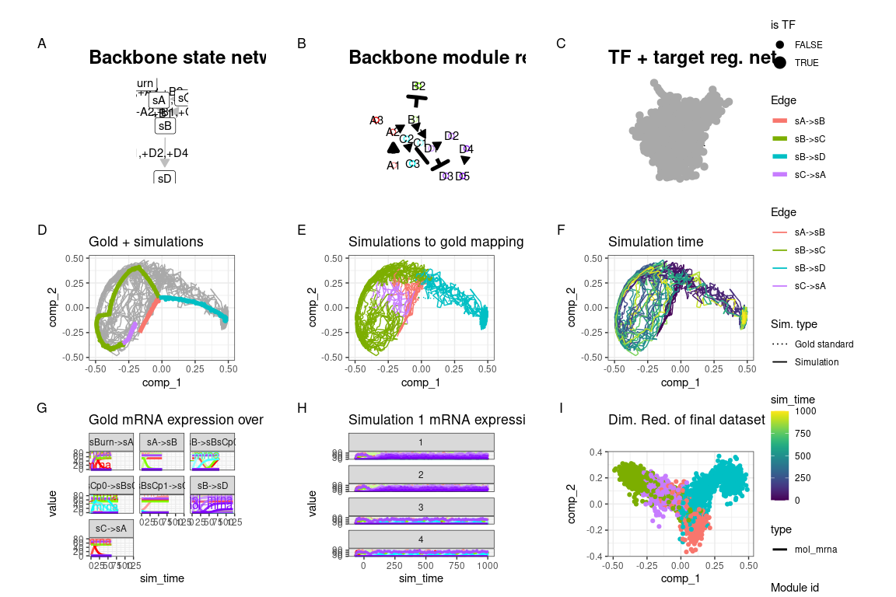<!-- -->

Both datasets are stored in a list for easy usage by countsimQC.

``` r
datasets <- list(
  real = t(as.matrix(realcount)),
  dyngen = t(as.matrix(out$dataset$counts))
)

ddsList <- lapply(datasets, function(ds) {
  DESeq2::DESeqDataSetFromMatrix(
    countData = round(as.matrix(ds)), 
    colData = data.frame(sample = seq_len(ncol(ds))), 
    design = ~1
  )
})
```

### Run countsimQC computations

Below are some computations countsimQC makes. Normally these are not
visible to the user, but for the sake of transparency these are included
in the vignette.

``` r
library(countsimQC)

### Define helper objects
nDatasets <- length(ddsList)
colRow <- c(2, 1)
panelSize <- 4
thm <- 
  theme_bw() + 
  theme(
    axis.text = element_text(size = 15),
    axis.title = element_text(size = 14),
    strip.text = element_text(size = 15)
  )
```

Compute key characteristics

``` r
obj <- countsimQC:::calculateDispersionsddsList(ddsList = ddsList, maxNForDisp = Inf)

sampleCorrDF <- countsimQC:::calculateSampleCorrs(ddsList = obj, maxNForCorr = 500)

featureCorrDF <- countsimQC:::calculateFeatureCorrs(ddsList = obj, maxNForCorr = 500)
```

Summarize sample characteristics

``` r
sampleDF <- map2_df(obj, names(obj), function(x, dataset_name) {
  tibble(
    dataset = dataset_name,
    Libsize = colSums(x$dge$counts),
    Fraczero = colMeans(x$dge$counts == 0),
    TMM = x$dge$samples$norm.factors,
    EffLibsize = Libsize * TMM
  )
})
```

Summarize feature characteristics

``` r
featureDF <- map2_df(obj, names(obj), function(x, dataset_name) {
  rd <- SummarizedExperiment::rowData(x$dds)
  tibble(
    dataset = dataset_name,
    Tagwise = sqrt(x$dge$tagwise.dispersion),
    Common = sqrt(x$dge$common.dispersion),
    Trend = sqrt(x$dge$trended.dispersion),
    AveLogCPM = x$dge$AveLogCPM,
    AveLogCPMDisp = x$dge$AveLogCPMDisp, 
    average_log2_cpm = apply(edgeR::cpm(x$dge, prior.count = 2, log = TRUE), 1, mean), 
    variance_log2_cpm = apply(edgeR::cpm(x$dge, prior.count = 2, log = TRUE), 1, var),
    Fraczero = rowMeans(x$dge$counts == 0),
    dispGeneEst = rd$dispGeneEst,
    dispFit = rd$dispFit,
    dispFinal = rd$dispersion,
    baseMeanDisp = rd$baseMeanDisp,
    baseMean = rd$baseMean
  )
})
```

Summarize data set characteristics

``` r
datasetDF <- map2_df(obj, names(obj), function(x, dataset_name) {
  tibble(
    dataset = dataset_name,
    prior_df = paste0("prior.df = ", round(x$dge$prior.df, 2)),
    nVars = nrow(x$dge$counts),
    nSamples = ncol(x$dge$counts),
    AveLogCPMDisp = 0.8 * max(featureDF$AveLogCPMDisp),
    Tagwise = 0.9 * max(featureDF$Tagwise)
  )
})
```

### Data set dimensions

These bar plots show the number of samples (columns) and features (rows)
in each data set.

Number of samples (columns)

``` r
ggplot(datasetDF, aes(x = dataset, y = nSamples, fill = dataset)) + 
  geom_bar(stat = "identity", alpha = 0.5) + 
  xlab("") + ylab("Number of samples (columns)") + 
  thm + theme(axis.text.x = element_text(angle = 90, hjust = 1, vjust = 0.5))
```

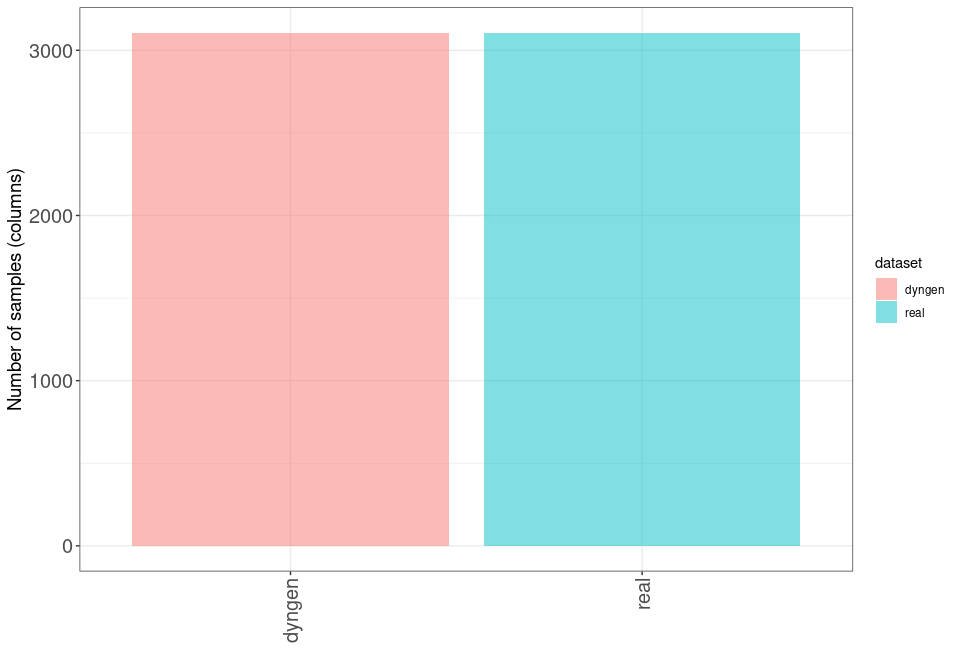<!-- -->

Number of features (rows)

``` r
ggplot(datasetDF, aes(x = dataset, y = nVars, fill = dataset)) + 
  geom_bar(stat = "identity", alpha = 0.5) + 
  xlab("") + ylab("Number of features (rows)") + 
  thm + theme(axis.text.x = element_text(angle = 90, hjust = 1, vjust = 0.5))
```

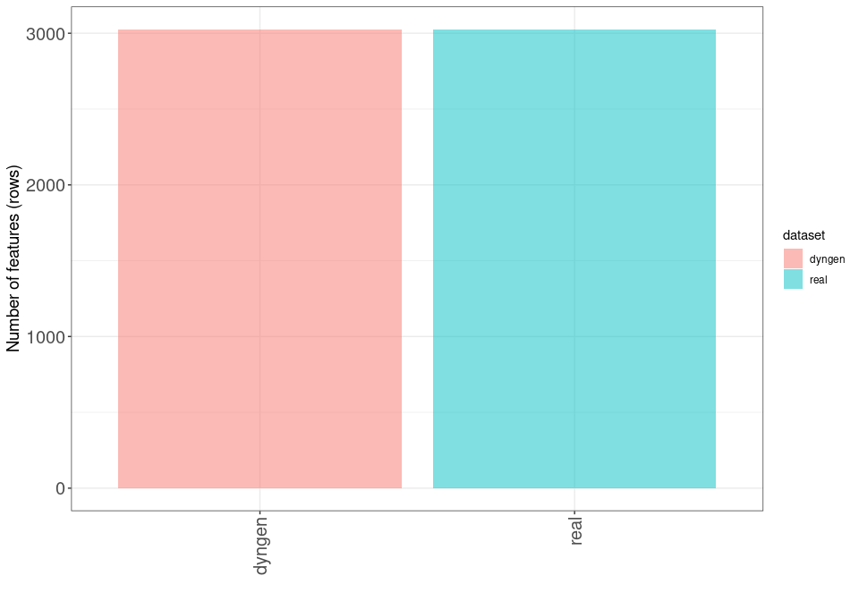<!-- -->

### Dispersion/BCV plots

Disperson/BCV plots show the association between the average abundance
and the dispersion or “biological coefficient of variation”
(sqrt(dispersion)), as calculated by
[`edgeR`](https://bioconductor.org/packages/release/bioc/html/edgeR.html)
[@robinson_edgerbioconductorpackage_2010] and
[`DESeq2`](http://bioconductor.org/packages/release/bioc/html/DESeq2.html)
[@love_moderatedestimationfold_2014]. In the `edgeR` plot, the estimate of the
prior degrees of freedom is indicated.

#### edgeR

The black dots represent the tagwise dispersion estimates, the red line
the common dispersion and the blue curve represents the trended
dispersion estimates. For further information about the dispersion
estimation in `edgeR`, see Chen et al. [@chen_differentialexpressionanalysis_2014].

``` r
ggplot(featureDF %>% dplyr::arrange(AveLogCPMDisp), 
       aes(x = AveLogCPMDisp, y = Tagwise)) + 
  geom_point(size = 0.25, alpha = 0.5) + 
  facet_wrap(~dataset, nrow = colRow[2]) + 
  geom_line(aes(y = Trend), color = "blue", size = 1.5) + 
  geom_line(aes(y = Common), color = "red", size = 1.5) +
  geom_text(data = datasetDF, aes(label = prior_df)) + 
  xlab("Average log CPM") + ylab("Biological coefficient of variation") + 
  thm
```

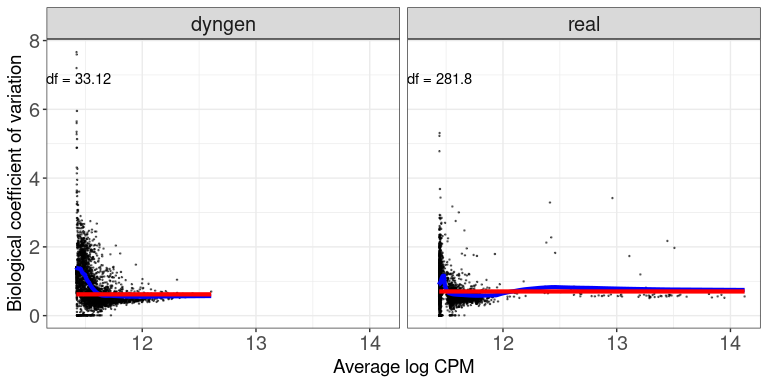<!-- -->

#### DESeq2

The black dots are the gene-wise dispersion estimates, the red curve the
fitted mean-dispersion relationship and the blue circles represent the
final dispersion estimates.For further information about the dispersion
estimation in `DESeq2`, see Love et al. [@love_moderatedestimationfold_2014].

``` r
ggplot(featureDF %>% dplyr::arrange(baseMeanDisp), 
       aes(x = baseMeanDisp, y = dispGeneEst)) + 
  geom_point(size = 0.25, alpha = 0.5) + 
  facet_wrap(~dataset, nrow = colRow[2]) + scale_x_log10() + scale_y_log10() +  
  geom_point(aes(y = dispFinal), color = "lightblue", shape = 21) + 
  geom_line(aes(y = dispFit), color = "red", size = 1.5) + 
  xlab("Base mean") + ylab("Dispersion") + 
  thm
```

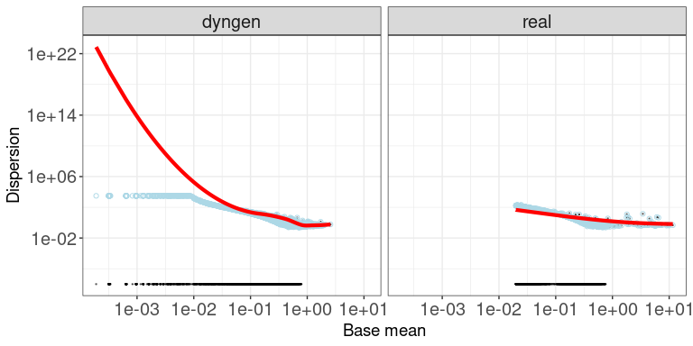<!-- -->

### Mean-variance plots

This scatter plot shows the relation between the empirical mean and
variance of the features. The difference between these mean-variance
plots and the mean-dispersion plots above is that the plots in this
section do not take the information about the experimental design and
sample grouping into account, but simply display the mean and variance
of log2(CPM) estimates across all samples, calculated using the `cpm`
function from
[`edgeR`](https://bioconductor.org/packages/release/bioc/html/edgeR.html)
[@robinson_edgerbioconductorpackage_2010], with a prior count of 2.

``` r
ggplot(featureDF, aes(x = average_log2_cpm, y = variance_log2_cpm)) + 
  geom_point(size = 0.75, alpha = 0.5) + 
  facet_wrap(~dataset, nrow = colRow[2]) + 
  xlab("Mean of log2(CPM)") + ylab("Variance of log2(CPM)") + 
  thm
```

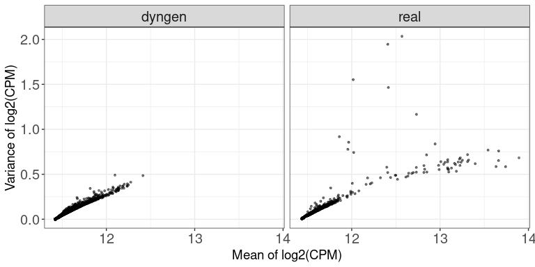<!-- -->

### Library sizes

This plot shows a histogram of the total read count per sample, i.e.,
the column sums of the respective data matrices.

``` r
ggplot(sampleDF, aes(x = Libsize)) + geom_histogram(bins = 30) + 
  facet_wrap(~dataset, nrow = colRow[2]) +
  xlab("Library size") + thm
```

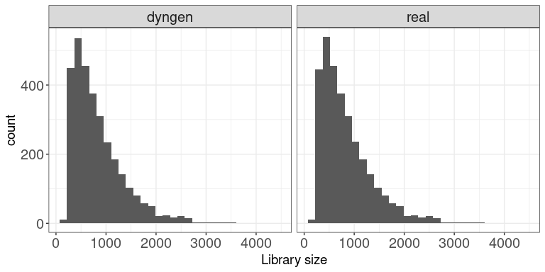<!-- -->

### TMM normalization factors

This plot shows a histogram of the TMM normalization factors [@robinson_scalingnormalizationmethod_2010], intended to adjust for differences in RNA
composition, as calculated by
[`edgeR`](https://bioconductor.org/packages/release/bioc/html/edgeR.html)
[@robinson_edgerbioconductorpackage_2010].

``` r
ggplot(sampleDF, aes(x = TMM)) + geom_histogram(bins = 30) + 
  facet_wrap(~dataset, nrow = colRow[2]) +
  xlab("TMM normalization factor") + thm
```

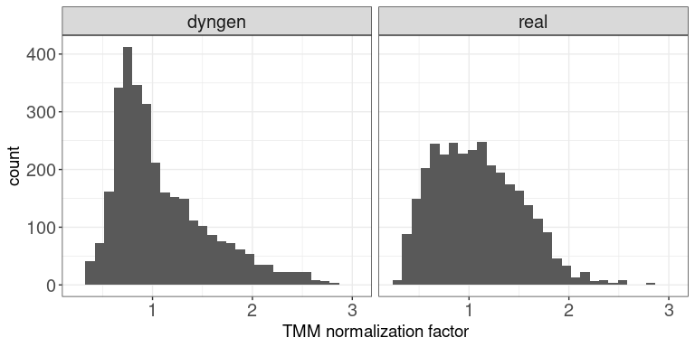<!-- -->

### Effective library sizes

This plot shows a histogram of the “effective library sizes,” defined as
the total count per sample multiplied by the corresponding TMM
normalization factor.

``` r
ggplot(sampleDF, aes(x = EffLibsize)) + geom_histogram(bins = 30) + 
  facet_wrap(~dataset, nrow = colRow[2]) +
  xlab("Effective library size") + thm
```

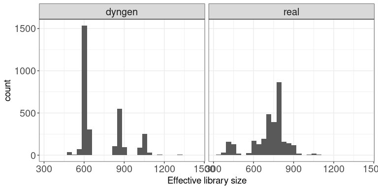<!-- -->

### Expression distributions (average log CPM)

This plot shows the distribution of average abundance values for the
features. The abundances are log CPM values calculated by `edgeR`.

``` r
ggplot(featureDF, aes(x = AveLogCPM)) + geom_histogram(bins = 30) + 
  facet_wrap(~dataset, nrow = colRow[2]) +
  xlab("Average log CPM") + thm
```

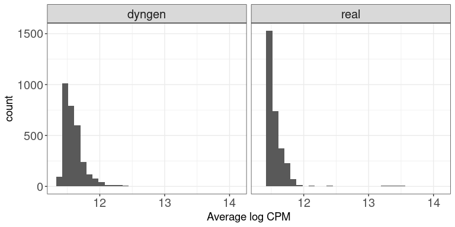<!-- -->

### Fraction zeros per sample

This plot shows the distribution of the fraction of zeros observed per
sample (column) in the count matrices.

``` r
ggplot(sampleDF, aes(x = Fraczero)) + geom_histogram(bins = 30) + 
  facet_wrap(~dataset, nrow = colRow[2]) +
  xlab("Fraction zeros per sample") + thm
```

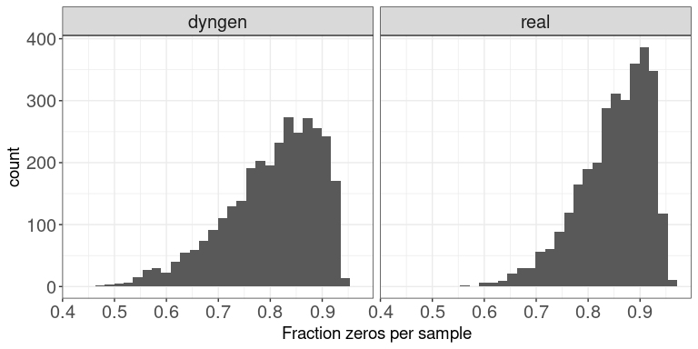<!-- -->

### Fraction zeros per feature

This plot illustrates the distribution of the fraction of zeros observed
per feature (row) in the count matrices.

``` r
ggplot(featureDF, aes(x = Fraczero)) + geom_histogram(bins = 30) + 
  facet_wrap(~dataset, nrow = colRow[2]) +
  xlab("Fraction zeros per feature") + thm
```

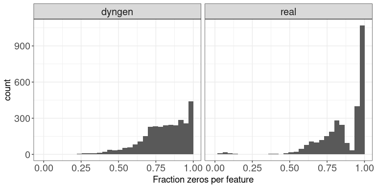<!-- -->

### Sample-sample correlations

The plot below shows the distribution of Spearman correlation
coefficients for pairs of samples, calculated from the log(CPM) values
obtained via the `cpm` function from `edgeR`, with a prior.count of 2.

``` r
ggplot(sampleCorrDF, aes(x = Correlation)) + geom_histogram(bins = 30) + 
  facet_wrap(~dataset, nrow = colRow[2]) +
  xlab("Sample-sample correlation") + thm
```

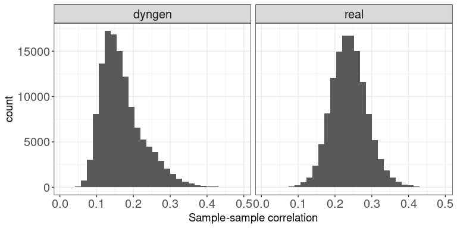<!-- -->

### Feature-feature correlations

This plot illustrates the distribution of Spearman correlation
coefficients for pairs of features, calculated from the log(CPM) values
obtained via the `cpm` function from `edgeR`, with a prior.count of 2.
Only non-constant features are considered.

``` r
ggplot(featureCorrDF, aes(x = Correlation)) + geom_histogram(bins = 30) + 
  facet_wrap(~dataset, nrow = colRow[2]) +
  xlab("Feature-feature correlation") + thm
```

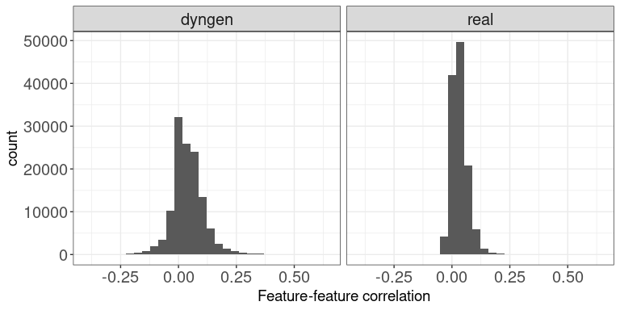<!-- -->

### Library size vs fraction zeros

This scatter plot shows the association between the total count (column
sums) and the fraction of zeros observed per sample.

``` r
ggplot(sampleDF, aes(x = Libsize, y = Fraczero)) + 
  geom_point(size = 1, alpha = 0.5) + 
  facet_wrap(~dataset, nrow = colRow[2]) + 
  xlab("Library size") + ylab("Fraction zeros") + thm
```

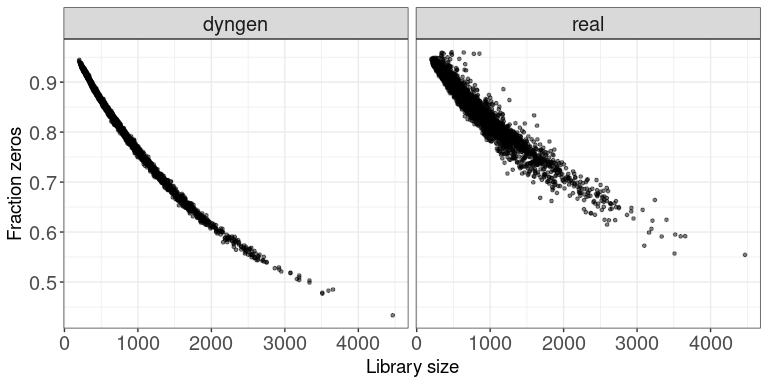<!-- -->

### Mean expression vs fraction zeros

This scatter plot shows the association between the average abundance
and the fraction of zeros observed per feature. The abundance is defined
as the log(CPM) values as calculated by `edgeR`.

``` r
ggplot(featureDF, aes(x = AveLogCPM, y = Fraczero)) + 
  geom_point(size = 0.75, alpha = 0.5) + 
  facet_wrap(~dataset, nrow = colRow[2]) + 
  xlab("Average log CPM") + ylab("Fraction zeros") + thm
```

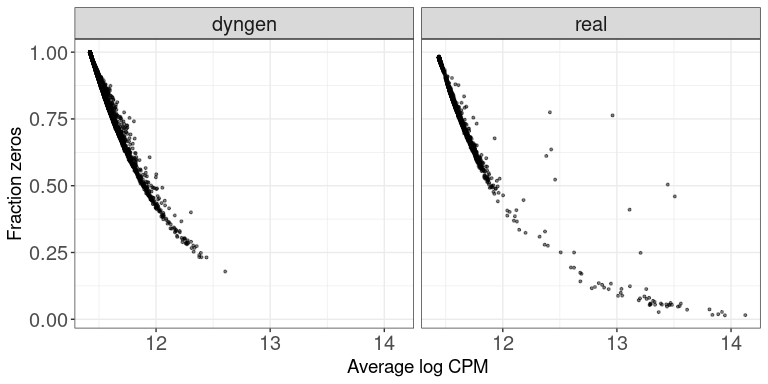<!-- -->


## Vignette: On scalability and runtime


In this vignette, we will take a look at the runtime of dyngen as the
number of genes and the number of cells sampled is increased. We’ll be
using the bifurcating cycle backbone which is well known for its
beautiful 3D butterfly shape!

``` r
library(dyngen)
library(tidyverse)

set.seed(1)

save_dir <- "scalability_and_runtime_runs"
if (!dir.exists(save_dir)) dir.create(save_dir, recursive = TRUE)

backbone <- backbone_bifurcating_cycle()
```

### Initial run

We’ll be running this simulation a few times, with different values for
`num_cells` and `num_features` to assess the scalability of dyngen. An
example of a resulting dyngen model is shown here.

``` r
num_cells <- 100
num_features <- 100
num_tfs <- nrow(backbone$module_info)
num_targets <- round((num_features - num_tfs) / 2)
num_hks <- num_features - num_targets - num_tfs

out <- 
  initialise_model(
    backbone = backbone,
    num_tfs = num_tfs,
    num_targets = num_targets,
    num_hks = num_hks,
    num_cells = num_cells,
    gold_standard_params = gold_standard_default(
      census_interval = 1,
      tau = 100/3600
    ),
    simulation_params = simulation_default(
      census_interval = 10,
      ssa_algorithm = ssa_etl(tau = 300/3600),
      experiment_params = simulation_type_wild_type(
        num_simulations = num_cells / 10
      )
    ),
    verbose = FALSE
  ) %>% 
  generate_dataset(make_plots = TRUE)
```

``` r
out$plot
```

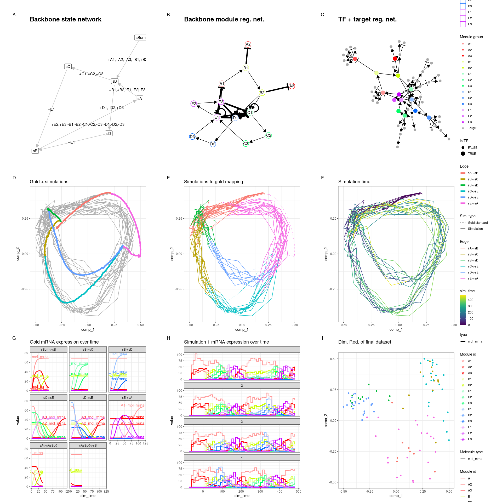<!-- -->

We tweaked some of the parameters by running this particular backbone
once with `num_cells = 100` and `num_features = 100` and verifying that
the new parameters still yield the desired outcome. The parameters we
tweaked are:

-   On average, 10 cells are sampled per simulation
    (e.g. `num_simulations = 100` and `num_cells = 1000`). You could
    increase this ratio to get a better cell count yield from a given
    set of simulations, but cells from the same simulation that are
    temporally close will have highly correlated expression profiles.
-   Increased time steps `tau`. This will make the Gillespie algorithm
    slightly faster but might result in unexpected artifacts in the
    simulated data.
-   `census_interval` increased from 4 to 10. This will cause dyngen to
    store an expression profile only every 10 time units. Since the
    total simulation time is xxx, each simulation will result in yyy
    data points. Note that on average only 10 data points are sampled
    per simulation.

For more information on parameter tuning, see the vignette ‘Advanced:
tuning the simulation parameters’.

### Timing experiments

The simulations are run once with a large `num_features` and
`num_cells`, a few times with varying `num_cells` and then once more
with varying `num_features`. Every run is repeated three times in order
to get a bit more stable time measurements. Since some of the
simulations can take over 10 minutes, the timings results of the
simulations are cached in the ‘scalability\_and\_runtime\_runs’
folder.\`

``` r
settings <- bind_rows(
  tibble(num_cells = 10000, num_features = 10000, rep = 1), #, rep = seq_len(3)),
  crossing(
    num_cells = seq(1000, 10000, by = 1000),
    num_features = 100,
    rep = seq_len(3)
  ),
  crossing(
    num_cells = 100,
    num_features = seq(1000, 10000, by = 1000),
    rep = seq_len(3)
  )
) %>% 
  mutate(filename = paste0(save_dir, "/cells", num_cells, "_feats", num_features, "_rep", rep, ".rds"))

timings <- pmap_dfr(settings, function(num_cells, num_features, rep, filename) {
  if (!file.exists(filename)) {
    set.seed(rep)
    
    cat("Running num_cells: ", num_cells, ", num_features: ", num_features, ", rep: ", rep, "\n", sep = "")
    num_tfs <- nrow(backbone$module_info)
    num_targets <- round((num_features - num_tfs) / 2)
    num_hks <- num_features - num_targets - num_tfs
    
    out <- 
      initialise_model(
        backbone = backbone,
        num_tfs = num_tfs,
        num_targets = num_targets,
        num_hks = num_hks,
        num_cells = num_cells,
        gold_standard_params = gold_standard_default(
          census_interval = 1,
          tau = 100/3600
        ),
        simulation_params = simulation_default(
          census_interval = 10,
          ssa_algorithm = ssa_etl(tau = 300/3600),
          experiment_params = simulation_type_wild_type(
            num_simulations = num_cells / 10
          )
        ),
        verbose = FALSE
      ) %>% 
      generate_dataset()
    
    tim <- 
      get_timings(out$model) %>% 
      mutate(rep, num_cells, num_features)
    
    write_rds(tim, filename, compress = "gz")
  }
  
  read_rds(filename)
})

timings_gr <- 
  timings %>% 
  group_by(group, task, num_cells, num_features) %>% 
  summarise(time_elapsed = mean(time_elapsed), .groups = "drop")

timings_sum <-
  timings %>% 
  group_by(num_cells, num_features, rep) %>%
  summarise(time_elapsed = sum(time_elapsed), .groups = "drop")
```

### Simulate a large dataset (10k × 10k)

Below is shown the timings of each of the steps in simulating a dyngen
dataset containing 10’000 genes and 10’000 features. The total
simulation time required is 1147 seconds, most of which is spent
performing the simulations itself.

``` r
timings0 <- 
  timings_gr %>% 
  filter(num_cells == 10000, num_features == 10000) %>% 
  mutate(name = forcats::fct_rev(forcats::fct_inorder(paste0(group, ": ", task))))

ggplot(timings0) + 
  geom_bar(aes(x = name, y = time_elapsed, fill = group), stat = "identity") +
  scale_fill_brewer(palette = "Dark2") + 
  theme_classic() +
  theme(legend.position = "none") +
  coord_flip() + 
  labs(x = NULL, y = "Time (s)", fill = "dyngen stage")
```

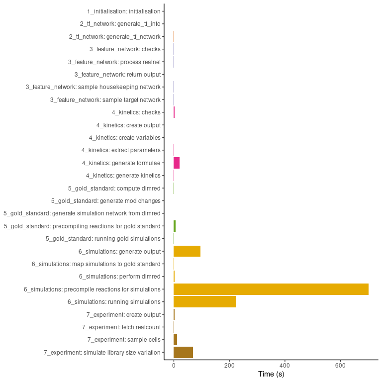<!-- -->

### Increasing the number of cells

By increasing the number of cells from 1000 to 10’000 whilst keeping the
number of features fixed, we can get an idea of how the simulation time
scales w.r.t. the number of cells.

``` r
timings1 <- 
  timings_gr %>% 
  filter(num_features == 100) %>% 
  group_by(num_cells, num_features, group) %>%
  summarise(time_elapsed = sum(time_elapsed), .groups = "drop")

ggplot(timings1) + 
  geom_bar(aes(x = forcats::fct_inorder(as.character(num_cells)), y = time_elapsed, fill = forcats::fct_inorder(group)), stat = "identity") +
  theme_classic() +
  scale_fill_brewer(palette = "Dark2") +
  labs(x = "Number of cells", y = "Average time (s)", fill = "dyngen step")
```

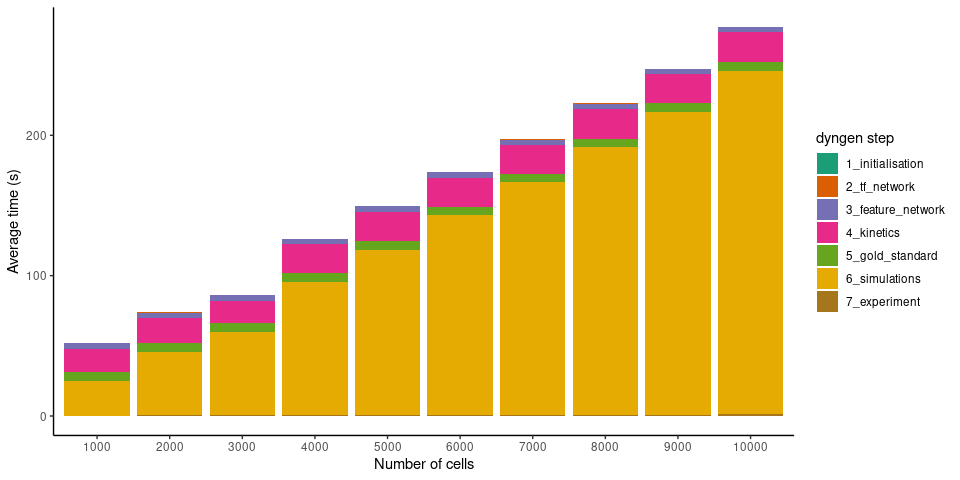<!-- -->

It seems the execution time scales linearly w.r.t. the number of cells.
This makes sense, because as the number of cells are increased, so do we
increase the number of simulations made (which is not necessarily
mandatory). Since the simulations are independent of each other and take
up the most time, the execution time will scale linearly.

``` r
ggplot(timings_sum %>% filter(num_features == 100)) + 
  theme_bw() +
  geom_point(aes(num_cells, time_elapsed)) +
  scale_x_continuous(limits = c(0, 10000)) +
  scale_y_continuous(limits = c(0, 300)) +
  geom_abline(intercept = 22.097, slope = 0.0252) +
  labs(x = "Number of cells", y = "Execution time (s)")
```

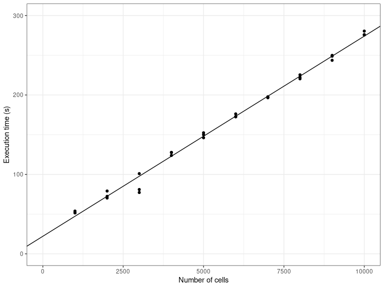<!-- -->

### Increasing the number of features

By increasing the number of features from 1000 to 10’000 whilst keeping
the number of cells fixed, we can get an idea of how the simulation time
scales w.r.t. the number of features

``` r
timings2 <- 
  timings_gr %>% 
  filter(num_cells == 100) %>% 
  group_by(num_cells, num_features, group) %>% 
  summarise(time_elapsed = sum(time_elapsed), .groups = "drop")

ggplot(timings2) + 
  geom_bar(aes(x = forcats::fct_inorder(as.character(num_features)), y = time_elapsed, fill = forcats::fct_inorder(group)), stat = "identity") +
  theme_classic() +
  scale_fill_brewer(palette = "Dark2") +
  labs(x = "Number of features", y = "Average time (s)", fill = "dyngen step")
```

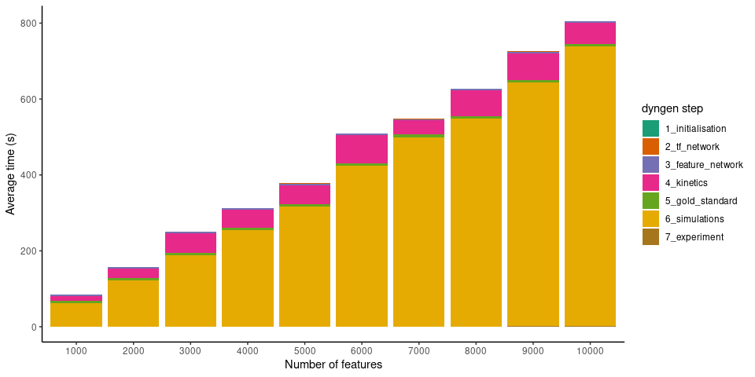<!-- -->

It seems the execution time also scales linearly w.r.t. the number of
features. As more genes are added to the underlying gene regulatory
network, the density of the graph doesn’t change, so it makes sense that
the execution time also scales linearly w.r.t. the number of features.

``` r
ggplot(timings_sum %>% filter(num_cells == 100)) + 
  theme_bw() +
  geom_point(aes(num_features, time_elapsed)) +
  scale_x_continuous(limits = c(0, 10000)) +
  scale_y_continuous(limits = c(0, 850)) +
  geom_abline(intercept = 0.5481, slope = 0.07988) +
  labs(x = "Number of features", y = "Execution time (s)")
```

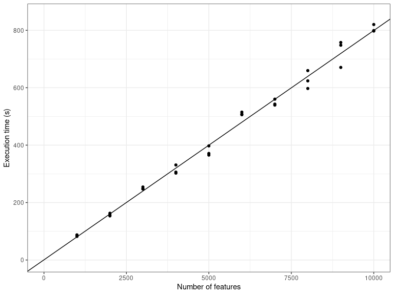<!-- -->

### Execution platform

These timings were measured using 30 (out of 32) threads using a AMD
Ryzen 9 5950X clocked at 3.4GHz.
